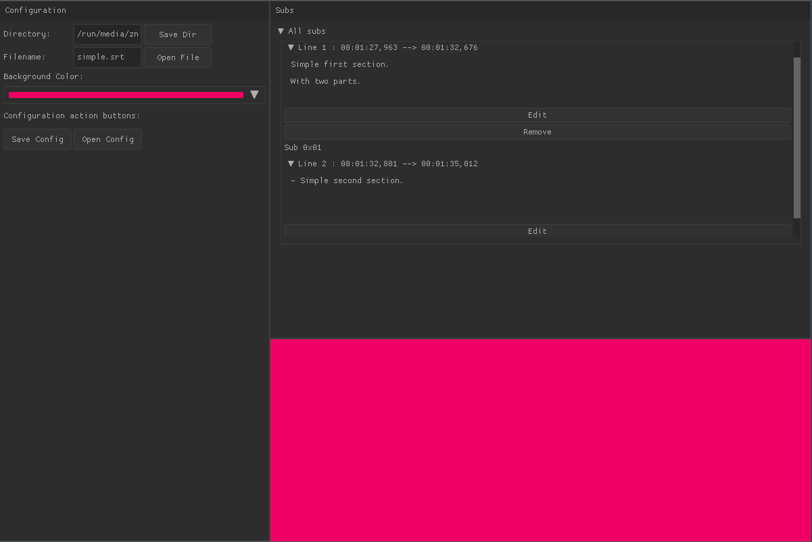

# srted - simple .srt subtitles editing

> Easy to use

> Simple design

> GUI or CLI interfaces

## Table of Contents

- [Installation](#installation)
- [Example](#example)

---

## Installation

```shell
$ git clone https://github.com/mcindrich/srted --recursive && cd srted && mkdir build && cd build && cmake .. && make
```

---

## Preview

### GUI (work in progress)


### CLI
```bash
$ srted --help
Usage: srted [options] [[--] args]
   or: srted [options]

A .srt file editor and a program for manipulation of srt files.

    -h, --help            show this help message and exit

Basic options
    -i, --input=<str>     input file
    -o, --output=<str>    output file
    -r, --hours           hours to add/subtract
    -m, --minutes         minutes to add/subtract
    -s, --seconds         seconds to add/subtract
    -n, --number=<int>    number of given time to change (by default in miliseconds)

Manipulating time of whole subtitles and specific subtitles.

$ # example - speed up the whole file for 33 seconds
$ srted -i examples/Parasite.2019.BLACK.N.WHiTE.EDiTiON.1080p.BluRay.x264-MiCiUS.srt -o examples/outfile.srt -n 33 -s
```